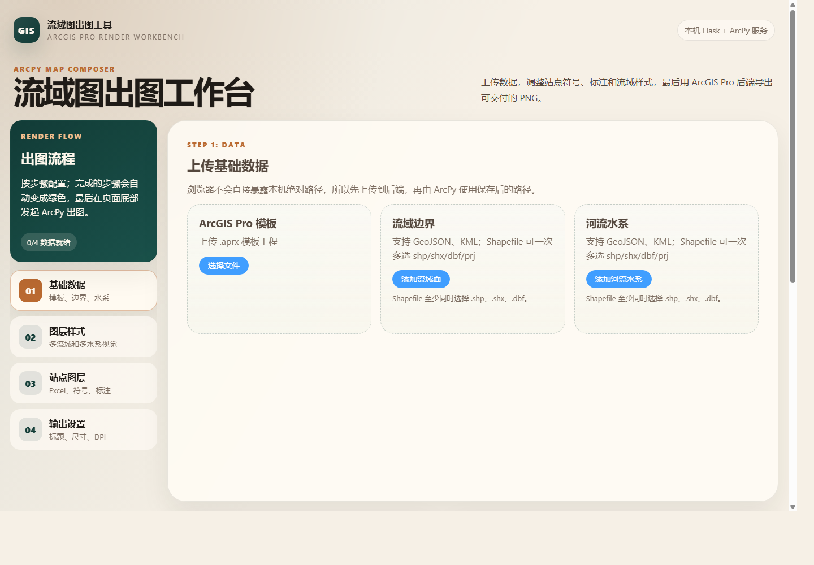
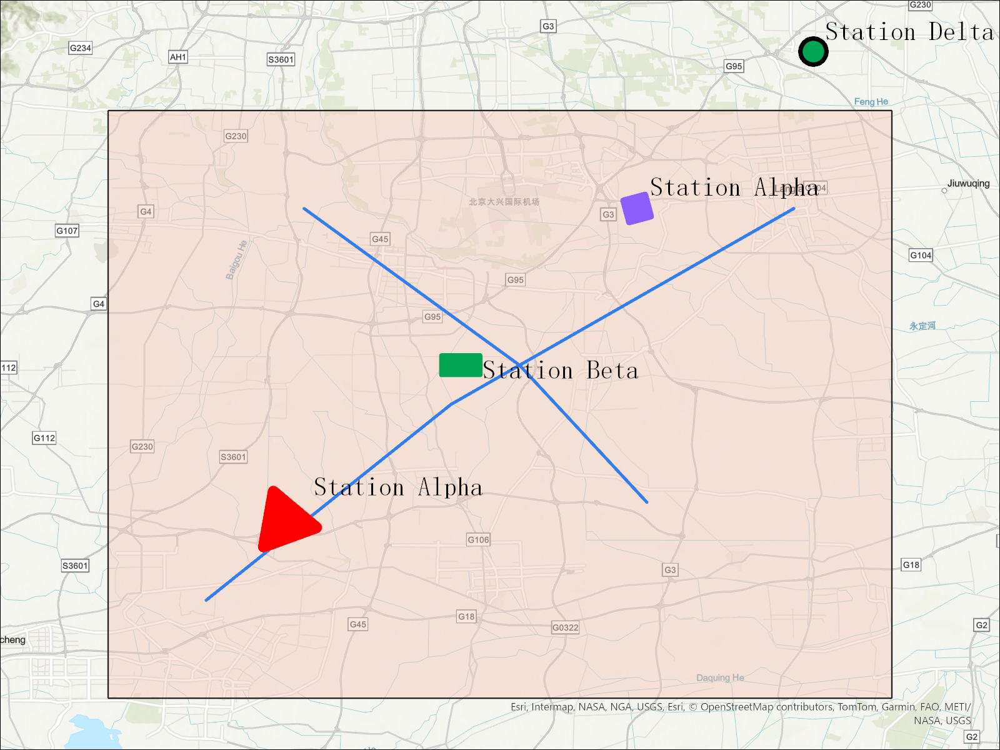

# GIS Flask Study Backend

这是一个简化后的 ArcGIS Pro 出图后端。现在项目只保留标准 Flask backend 结构，不再使用 CLI、不再使用 SQLite、不再创建异步 job；Apifox 可以直接请求接口，让后端把地图输出到项目配置的 `OUTPUT_FOLDER` 下。

## 快速使用 Web App

这个项目现在包含一个浏览器工作台：前端负责上传数据、配置样式和提交出图；后端用 Flask 接收请求，并在同一个 ArcGIS Pro Python 进程里调用 ArcPy 导出 `map.png`。



### 1. 启动后端

真实出图必须用 ArcGIS Pro Python 启动后端，因为普通 `.venv` 里没有 ArcPy：

```powershell
cd D:\work\2026\code\life\gis_flask_study
& "C:\Program Files\ArcGIS\Pro\bin\Python\Scripts\propy.bat" backend\run.py
```

如果你的电脑更习惯直接调用 ArcGIS Pro 环境里的 `python.exe`，也可以这样启动：

```powershell
cd D:\work\2026\code\life\gis_flask_study
& "C:\Program Files\ArcGIS\Pro\bin\Python\envs\arcgispro-py3\python.exe" backend\run.py
```

看到下面这行就说明后端已经启动：

```text
Running on http://127.0.0.1:5000
```

可以用健康检查确认：

```powershell
Invoke-RestMethod http://127.0.0.1:5000/api/health
```

### 2. 启动前端

另开一个 PowerShell 窗口：

```powershell
cd D:\work\2026\code\life\gis_flask_study\frontend
npm install
npm run dev
```

浏览器打开：

```text
http://127.0.0.1:5173
```

Vite 已经把 `/api` 代理到 `http://127.0.0.1:5000`，所以前端页面可以直接访问本地 Flask 后端。

### 3. 在页面里完成一次出图

按左侧流程从上到下配置：

1. **基础数据**：上传 `.aprx` 模板、流域边界、河流水系和站点 Excel。Shapefile 建议打包成 `.zip` 上传，也可以一次选择 `.shp/.shx/.dbf/.prj` 等组件文件。
2. **图层样式**：配置流域边界、流域填充和河流水系样式。
3. **站点图层**：上传站点 Excel 后，页面会读取表头和每一行点位。先选择经度字段、纬度字段和名称字段，再在“逐点样式”表格里给每个点单独设置形状、颜色、大小、旋转和标注。
4. **输出设置**：填写输出目录、标题、图片宽高和 DPI。默认情况下，`output_dir` 应使用相对路径，例如 `frontend_202604210009`。
5. 点击页面底部的 **开始出图**，等待后端生成 PNG。

页面底部的“请求体预览”会显示实际提交给 `/api/render` 的 JSON。调试逐点站点时，可以重点检查：

```json
"station_layers": [
  {
    "points": [
      {
        "row_number": 2,
        "symbol": {
          "shape": "triangle",
          "color_preset": "red"
        }
      }
    ]
  }
]
```

只要请求体里有 `points`，后端就会按 Excel 原始行号逐点渲染；没有 `points` 时，则兼容旧逻辑，整张站点 Excel 使用同一套图层默认样式。

### 4. 查看出图结果

本次测试示例使用的是 `output/frontend_202604210009`。成功后会生成：

```text
output/frontend_202604210009/
  map.png
  result.json
  gistool_test.aprx
  station_group_table_0_0.csv
  station_layer_0_group_0.*
  station_group_table_0_1.csv
  station_layer_0_group_1.*
  ...
```

`station_layer_0_group_0.*`、`station_layer_0_group_1.*` 这类文件表示同一个 Excel 内部已经按不同样式拆成多个内部站点图层。样式相同的点会合并到同一个内部图层，样式不同的点会分开渲染。

下面是 `frontend_202604210009` 的示例结果，4 个站点来自同一个 Excel，但每个点使用了不同的符号样式：



### 常见问题

- 如果页面显示 `failed`，先打开对应输出目录里的 `result.json`，里面有真实 ArcPy 错误。
- 修改后端代码后，需要在后端 PowerShell 窗口按 `Ctrl + C` 停止服务，再重新运行 `backend\run.py`。
- 如果站点还是整层同一种颜色或形状，检查“请求体预览”里是否带有 `station_layers[].points`。
- 如果边缘点或标注被裁掉，确认后端已经重启到最新代码；当前版本会把流域、河流和站点一起纳入地图范围，并自动添加 buffer。

## 项目结构

```text
backend/
  run.py
  app/
    __init__.py
    api/
      health.py
      options.py
      render.py
    core/
      config.py
      constants.py
    gis/
      render/
        arcpy_renderer.py
    utils/
      responses.py
tests/
  test_backend_api.py
  test_arcpy_renderer.py
frontend/
  src/
    views/
    components/
    stores/
    api/
```

## 推荐部署方式

推荐把 Flask 固定安装到项目自己的 `.venv`，然后仍然用 ArcGIS Pro 自带 Python 启动后端：

```text
项目 .venv
  存放 Flask 等普通 Python 依赖

ArcGIS Pro Python / propy.bat
  提供 arcpy，并在启动时额外查找项目 .venv\Lib\site-packages
```

先安装项目依赖：

```powershell
.\scripts\setup.ps1
```

安装脚本固定要求 Python 3.9。默认会调用 `python3.9`，如果你的电脑没有这个命令，可以传入 Python 3.9 的完整路径：

```powershell
.\scripts\setup.ps1 -PythonPath "D:\Python39\python.exe"
```

如果默认 PyPI 网络慢或代理报错，可以改用镜像源：

```powershell
.\scripts\setup.ps1 -IndexUrl https://pypi.tuna.tsinghua.edu.cn/simple
```

再检查 ArcGIS Pro Python 能否找到项目 `.venv` 里的 Flask：

```powershell
.\scripts\check_runtime.ps1
```

如果 ArcGIS Pro 不是默认安装路径，可以通过参数或环境变量指定 `propy.bat`：

```powershell
.\scripts\check_runtime.ps1 -PropyPath "D:\ArcGIS\Pro\bin\Python\Scripts\propy.bat"
$env:ARCGIS_PROPY="D:\ArcGIS\Pro\bin\Python\Scripts\propy.bat"
```

最后启动后端：

```powershell
& "C:\Program Files\ArcGIS\Pro\bin\Python\Scripts\propy.bat" backend\run.py
```

## 前端工作台

前端位于 `frontend/`，使用 Vue 3、Vite、TypeScript、Pinia、Axios 和 Element Plus。
页面风格借鉴 Gitee 参考项目的暖色纸张感工作台，但保留 Element Plus 的表单、上传和颜色选择器。

启动后端后，再启动前端：

```powershell
cd frontend
npm install
npm run dev
```

开发服务器默认地址是：

```text
http://localhost:5173
```

Vite 已把 `/api` 代理到 `http://localhost:5000`，所以前端可以直接调用当前 Flask 后端。

前端第一版支持：

- 上传 `.aprx` 模板、流域边界、河流水系、站点 Excel。
- Shapefile 建议打包成 `.zip` 上传。
- 配置输出尺寸、DPI、流域边界、流域填充、河流线宽和颜色。
- 支持一个站点 Excel 图层内逐点配置形状、颜色、大小、标注颜色、字号、位置和旋转角度。
- 在逐点样式表格里直接预览每个点当前的符号形状和颜色。
- 复制 `/api/render` JSON 请求体，方便继续用 Apifox 对照调试。
- 出图成功后在页面中预览最终 `map.png`。

后端默认只监听本机 `127.0.0.1:5000`，并且默认关闭 Flask debug。局域网联调时再显式设置：

```powershell
$env:FLASK_HOST="0.0.0.0"
$env:FLASK_DEBUG="true"
```

## 通用环境部署

这个后端有一个特殊点：Flask 服务和 ArcPy 必须在同一个 Python 进程里运行。因为 ArcPy 只能由 ArcGIS Pro Python 提供，所以启动时仍然使用 `propy.bat`。

为了让新电脑部署更简单，项目启动时会自动把下面两个目录加入 Python 搜索路径：

```text
<项目根目录>\.venv\Lib\site-packages
C:\Users\<用户名>\AppData\Roaming\Python\Python39\site-packages
```

也就是说，Flask 可以固定安装在项目 `.venv` 里，不需要再手动安装到 ArcGIS Pro Python 环境目录。

可以用这条命令检查：

```powershell
.\scripts\check_runtime.ps1
```

如果能打印 `Flask OK`，并且 `Flask file` 位于项目 `.venv\Lib\site-packages` 下面，就可以直接启动后端。
如果报 `ModuleNotFoundError: No module named 'flask'`，或提示 Flask 不是从项目 `.venv` 加载的，先运行：

```powershell
.\scripts\setup.ps1
```

### 为什么不直接用 .venv 启动后端

不要用下面这种方式启动真实出图服务：

```powershell
.\.venv\Scripts\python.exe backend\run.py
```

原因是 `.venv` 里有 Flask，但没有 ArcPy。真实出图仍然必须由 ArcGIS Pro Python 启动。

### 兼容方式：用户 site-packages

项目仍然兼容用户目录 site-packages。也就是说，如果某台电脑以前已经把 Flask 安装到了当前用户目录，后端依然能找到它。不过推荐新部署时统一使用项目 `.venv`。

模板工程路径不在代码里写死。推荐由前端或 Apifox 在每次请求的 `template_project` 字段里传入。
如果某个部署环境固定使用同一个模板，也可以设置环境变量：

```powershell
$env:ARCPY_TEMPLATE_PROJECT="D:\your\template.aprx"
$env:ARCGIS_PROPY="D:\your\ArcGIS\Pro\bin\Python\Scripts\propy.bat"
$env:OUTPUT_FOLDER="D:\your\output"
& $env:ARCGIS_PROPY backend\run.py
```

如果请求体没有传 `template_project`，并且也没有设置 `ARCPY_TEMPLATE_PROJECT`，`POST /api/render` 会返回 400，提示缺少模板路径。

## 接口

### GET /api/health

检查服务是否启动，并返回当前输出目录和模板工程路径。

### GET /api/render-options

返回前端或 Apifox 可用的固定选项，包括底图、标注位置、站点形状和站点颜色预设。

站点形状和颜色已经拆开，前端可以自由组合：

```text
station_symbol_shapes:
circle
triangle
square
diamond
rectangle

station_symbol_color_presets:
blue
cyan
purple
orange
green
red
black
```

旧版 `preset` 字段仍然兼容，例如 `circle_green`、`triangle_red`，但新请求建议使用
`shape + color_preset` 或 `shape + color`。

### POST /api/render

直接出图。请求体里传真实数据文件路径和相对输出目录，不再传 `file_id`。
默认情况下，`output_dir` 必须是相对路径，例如 `"demo_001"`，后端会把结果写入 `OUTPUT_FOLDER/demo_001`。
这样前端不能让服务器写入任意绝对目录；只有本地调试时才建议临时设置 `ALLOW_ABSOLUTE_OUTPUT_DIR=true`。
`output.width_px`、`output.height_px` 和 `output.dpi` 会共同控制最终 PNG 的像素尺寸。
后端会自动按模板布局单位换算页面大小，例如模板使用毫米时会把 `1600x1200@150dpi` 换算成约 `270.93mm x 203.2mm`。

Apifox 示例：

```json
{
  "output_dir": "demo_001",
  "map_title": "示例流域水系图",
  "output": {
    "width_px": 1600,
    "height_px": 1200,
    "dpi": 150
  },
  "inputs": {
    "basin_boundary": {
      "path": "D:/data/basin.geojson"
    },
    "river_network": {
      "path": "D:/data/rivers.geojson"
    },
    "station_layers": [
      {
        "path": "D:/data/green_stations.xlsx",
        "sheet_name": "Sheet1",
        "x_field": "lon",
        "y_field": "lat",
        "name_field": "name",
        "layer_name": "GreenCircleStations",
        "symbol": {
          "shape": "circle",
          "color_preset": "green",
          "size_pt": 20
        },
        "label": {
          "enabled": true,
          "color": "#000000",
          "font_size_pt": 20,
          "position": "top_right",
          "rotation_deg": 0
        }
      },
      {
        "path": "D:/data/red_stations.xlsx",
        "sheet_name": "Sheet1",
        "x_field": "lon",
        "y_field": "lat",
        "name_field": "name",
        "layer_name": "RedTriangleStations",
        "symbol": {
          "shape": "triangle",
          "color_preset": "red",
          "size_pt": 20
        },
        "label": {
          "enabled": true,
          "color": "#000000",
          "font_size_pt": 20,
          "position": "top_right",
          "rotation_deg": 0
        }
      }
    ]
  },
  "layout": {
    "basemap": "Topographic",
    "legend": {
      "enabled": true
    },
    "scale_bar": {
      "enabled": true
    }
  },
  "style": {
    "basin_boundary": {
      "color": "#222222",
      "width_pt": 1.2
    },
    "basin_fill": {
      "color": "#e6f0d4",
      "opacity": 0.45
    },
    "river_network": {
      "color": "#2f80ed",
      "width_pt": 2.5
    }
  }
}
```

成功后会在 `output_dir` 生成：

```text
map.png
result.json
gistool_test.aprx
```

### POST /api/uploads

前端文件上传接口。浏览器不能可靠读取用户电脑的绝对路径，所以前端先把文件上传给后端，
后端保存到 `uploads/` 后返回可供 `/api/render` 使用的本地路径。

请求类型是 `multipart/form-data`：

```text
kind: template_project | basin_boundary | river_network | station_excel
file: 用户选择的文件
```

返回示例：

```json
{
  "success": true,
  "data": {
    "file_id": "uuid",
    "kind": "basin_boundary",
    "original_name": "basin.geojson",
    "path": "D:/work/.../uploads/20260420/uuid/basin.geojson",
    "suffix": ".geojson",
    "size_bytes": 1234
  }
}
```

### GET /api/render/file

前端预览最终 PNG 使用的只读接口：

```text
/api/render/file?path=<后端返回的 output_png>
```

为了避免任意文件读取，这个接口只允许读取 `OUTPUT_FOLDER` 下面的 `.png` 文件。

## 模板工程要求

当前 ArcPy 渲染器会在 `.aprx` 里查找这些对象：

```text
Map: 地图
Layout: 布局
Map Frame: 地图框
Title text element: 标题
```

标题、图例、比例尺这些布局元素暂时不是强制项。如果模板里没有，出图仍会继续，缺失信息会写入 `result.json.warnings`。

## 测试

普通单元测试不需要 ArcGIS Pro：

```powershell
python -m pytest tests -q
```

真实 ArcPy 出图需要用 `propy.bat` 启动后端，然后用 Apifox 请求 `POST /api/render`。

## tests 目录说明

`tests/` 主要用来保护两类核心行为：

- `test_backend_api.py`：测试 Flask API 层，使用 `FakeRenderer` 替代真实 `ArcPyRenderer`，确认接口能正确校验参数、传递参数并返回统一 JSON。
- `test_arcpy_renderer.py`：测试 `ArcPyRenderer` 本身，但使用 fake `arcpy` 和一组假的 ArcGIS Pro 对象，确认渲染器对 ArcPy 的调用方式、参数、样式、标注和输出结果是否正确。

这些测试能防止应用代码被改坏，但不能替代真实 ArcGIS Pro 环境验证。真正确认 ArcPy、模板工程和用户数据能跑通，仍然需要在 ArcGIS Pro Python 环境中用真实数据单独跑一次。
