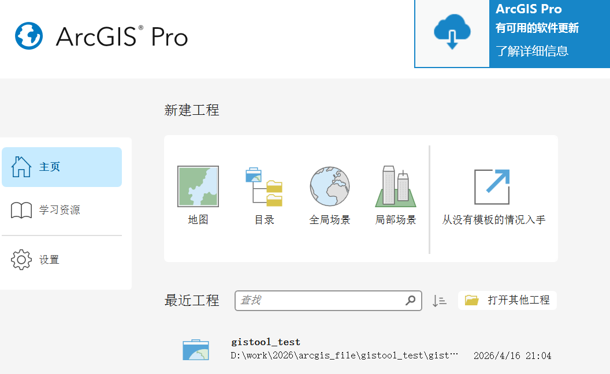
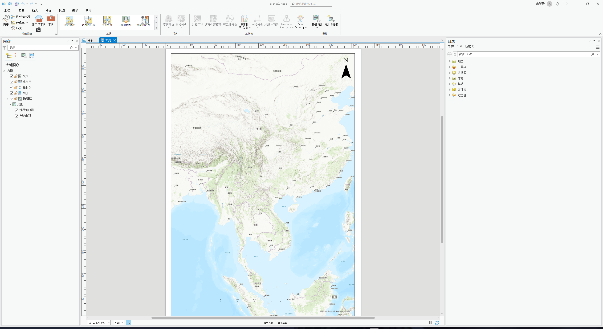
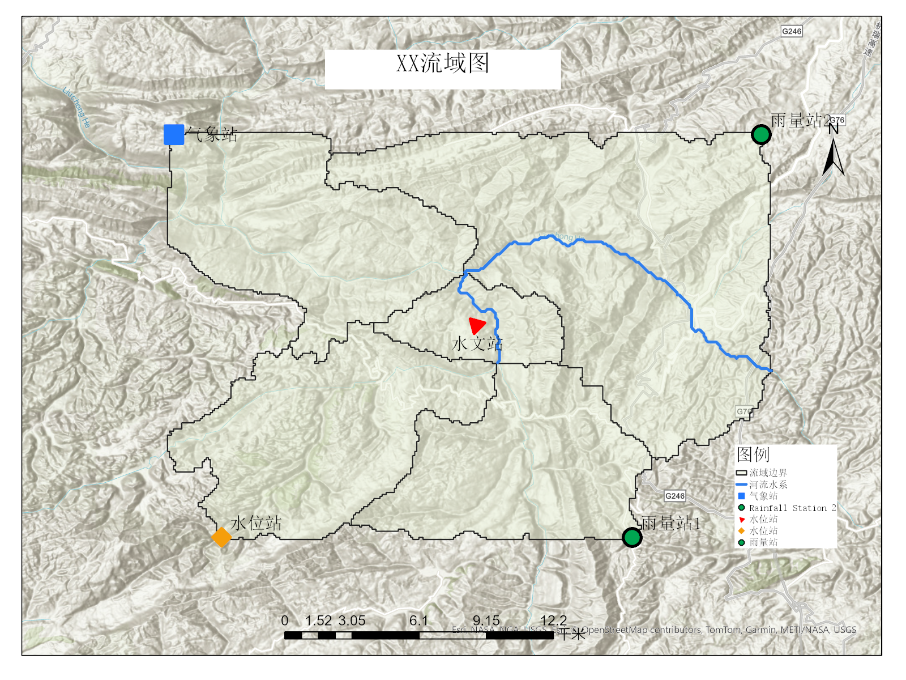
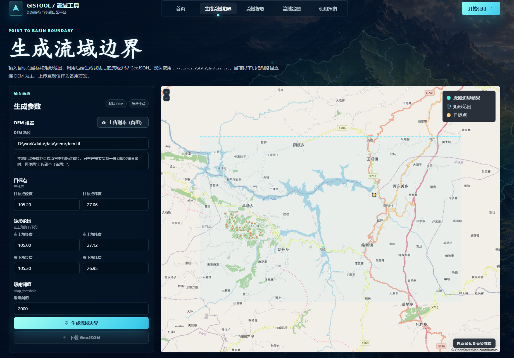
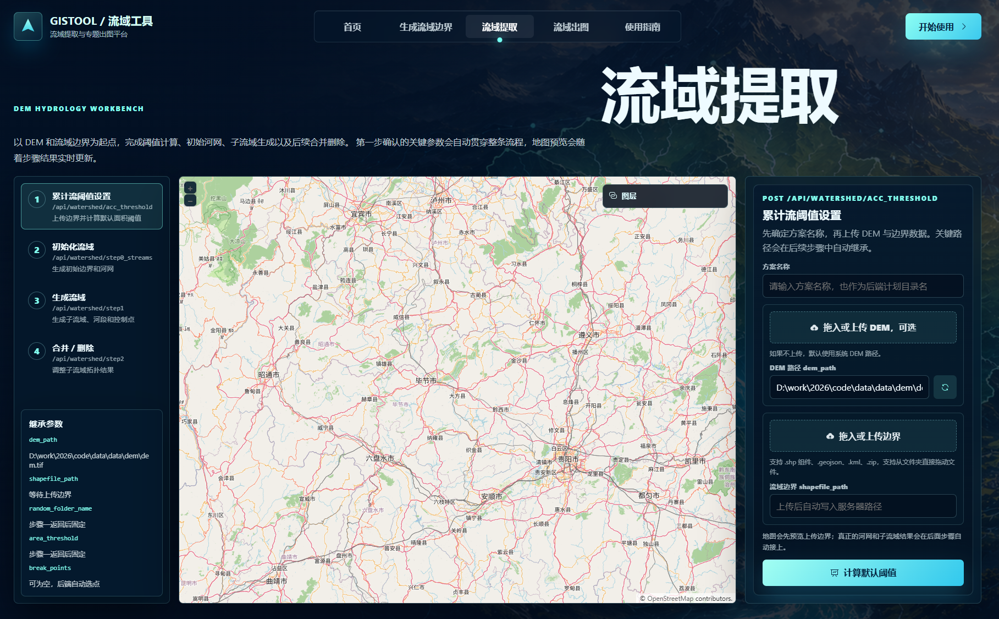
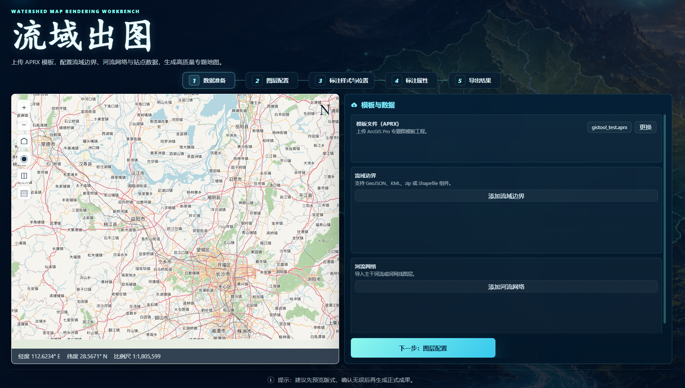

# ArcGIS Pro快速出流域图工具

这是一个简化后的快速出图 Web App。它简化了繁杂且缓慢的 ArcGIS Pro 操作步骤，方便水文水利行业工作者在编制报告时快速生成流域效果图。可能在配置环境会有一点点复杂（没办法，要怪就怪arcgis），但是可以用claude code或者codex等工具就简单啦，刷会儿抖音等一下就行了。后续会继续优化，敬请期待。

前提准备：

1. ArcGIS Pro 3.0.1 及以上，最好用python3.9。
2. ArcGIS Pro 的 `.aprx` 模板文件，也就是工程文件。需要提前在工程中创建好地图、布局、标题、图例、指南针、比例尺（预制菜），因为 ArcGIS Pro 3.0 版本的 ArcPy 没有生成地图和布局的能力，只能根据已有的模板来更改。

   
   
3. 流域边界、河流、站点 Excel 文件。

用这个项目你能得到什么：

1. “生成流域边界”：快速输出流域边界文件。
2. “流域提取”：依据用户需求（调整累积流阈值，合并/删除子流域）提取不同疏密程度的子流域边界、河流水系的geojson文件。
3. “流域出图”：快速gis出图，自定义点样式。直接得到.png文件，同时输出对应的arcgis pro的`.aprx`工程文件，方便更自由化的调整。

下面是经过这个web app出图效果示例：

为什么要用这个web app而不直接用arcgis pro：

1. 速度更快，操作方便，小白也能轻松上手，在上面数据准备好的情况下，出图仅几秒。
2. 可以任意调节每个点的形状样式、大小，甚至可以旋转（水文中经常需要将站点旋转到垂直于河流方向）
3. 自由程度高。output中还有更改后的.aprx文件，更改全程在.aprx工程副本中，出结果后可以再用arcgis pro对结果进行一些微调。

## 快速使用 Web App

这个项目现在包含三个并列功能：生成流域边界——流域提取——流域出图、。前端统一运行在 `5173`，后端按功能固定拆成 `5000/5001/5002` 三个进程，避免 ArcGIS Pro Python 和普通 GIS Python 依赖互相冲突。

### 0.功能说明

一、生成流域边界：

1. 输入DEM数据。
2. 输入流域出口的经纬度。
3. 矩形范围要把流域框进去，为了处理的更快，要是直接分析整个DEM计算量太大，容易崩溃。
4. 吸附阈值：流域出口不容易点到河道上，这个是吸附的范围。



二、流域提取

1. 上传基础数据：上传DEM和上一步生成的流域边界文件（已经有流域边界文件可以直接来这一步上传，支持.shp 组件、.geojson、.kml、.zip等文件格式）
2. 初始化流域：这里系统会输出一个较粗的默认阈值，可以直接用，也可以改一下（取决于你希望的河流疏密程度），面积阈值越小水系约密、子流域越多。
3. 生成流域：控制点是用户自定义的子流域出口（一般是水位站、水文站所在位置），一定在河道上。输入之后系统会根据这个控制点生成一个子流域。
4. 合并/删除：有些流域可以一起考虑它的流域特征，这时候就需要合并或删除。
5. 最终输出的流域水系和流域边界文件在gistool\docs\program路径下。



三、流域出图

1. 数据准备：模板文件我做了一版放到了`backend\templates\gistool_test\gistool_test.aprx`这个路径中；上传上一步流域提取生成的sub_catchment.geojson（流域边界）和river_network_linestrings.geojson（水系）文件。
2. 图层配置：设置样式的颜色透明度等
3. 标注样式与位置：上传点的坐标EXCEL文件，这个每一个StationLayer层代表了一个图例类（比如说水位站、雨量站两类），可以对StationLayer图层中每个点进行调整形状、大小、颜色、旋转度数、标注位置、标注字号等，嫌麻烦也可以设置好一个样式然后点击应用到全部。
4. 标注属性：设置标注在图例中的各种属性。
5. 到处结果：导出设置图的打印格式；人工布局坐标自定义图框的属性（XY代表位置、高宽代表尺寸）；标题的位置高宽；图例 / 比例尺 / 指北针的位置高宽；出图的视角调整。



### 1.最短部署路径

要准备两个 Python 运行，一个是ArcGIS Pro自带的（必须，不然不能用arcpy，不能用本项目的流域出图功能），另外的是提取流域边界和流域提取功能的python环境（最好用3.9，因为脚本统一安装环境是python3.9的），再用统一脚本一次启动。

必备运行时：

- ArcGIS Pro Python / `propy.bat`：只负责流域出图，因为它需要 ArcPy。
- 普通 Python：负责流域提取和生成流域边界，需要装好 `pysheds/rasterio/shapely/geopandas` 等依赖。当前开发机示例是 `D:\python3.9.5\python.exe`，但不是硬性路径。
- Node.js：负责启动 Vite 前端。

第一次部署先安装依赖：
因为ArcGIS Pro 自带的Python没有Flask包，所以部署时`.\scripts\setup.ps1` 会把 Flask 等普通 Python 包安装到项目自己的 `.venv`。流域出图服务启动时仍然用 ArcGIS Pro Python / `propy.bat`，因为它负责提供 ArcPy；项目代码会在启动时把 `.venv\Lib\site-packages` 加进 ArcGIS Pro Python 的搜索路径，让 ArcGIS Pro Python 也能找到 Flask。

注意：当前 `setup.ps1` 用来创建项目 `.venv` 的 Python 版本固定检查为 `3.9`。这不代表三个后端都必须用 Python 3.9；它只说明这个安装脚本目前要求用 Python 3.9 来创建 `.venv`。如果电脑没有 `python3.9` 命令，可以传入完整路径：

```powershell
cd D:\work\2026\code\life\gis_flask_study
.\scripts\setup.ps1
```

```powershell
.\scripts\setup.ps1 -PythonPath "D:\Python39\python.exe"
```

再安装前端依赖：

```powershell
cd D:\work\2026\code\life\gis_flask_study\frontend
npm install
```

如果 ArcGIS Pro 不在默认位置，也可以先验证它能否从项目 `.venv` 导入 Flask：

```powershell
.\scripts\check_runtime.ps1 -PropyPath "D:\ArcGIS\Pro\bin\Python\Scripts\propy.bat"
```

然后回到项目根目录启动整套项目：

```powershell
cd D:\work\2026\code\life\gis_flask_study
.\scripts\start-dev.ps1
```

默认端口固定为：


| 端口   | 功能                                        | Python 环境                    |
| ------ | ------------------------------------------- | ------------------------------ |
| `5000` | 流域出图`/map-output`                       | ArcGIS Pro Python /`propy.bat` |
| `5001` | 流域提取`/watershed-extract`                | 普通 GIS Python                |
| `5002` | 生成流域边界`/watershed-boundary-generator` | 普通 GIS Python                |
| `5173` | Vite 前端                                   | Node.js                        |

如果 ArcGIS Pro 或普通 GIS Python 不在默认路径，启动时传入路径：

```powershell
.\scripts\start-dev.ps1 `
  -PropyPath "D:\ArcGIS\Pro\bin\Python\Scripts\propy.bat" `
  -GisPythonPath "D:\Python39\python.exe"
```

启动后检查健康接口：

```powershell
Invoke-RestMethod http://127.0.0.1:5000/api/health
Invoke-RestMethod http://127.0.0.1:5001/api/health
Invoke-RestMethod http://127.0.0.1:5002/api/health
```

浏览器打开：

```text
http://localhost:5173/
```

常用页面：

```text
http://localhost:5173/map-output
http://localhost:5173/watershed-extract
http://localhost:5173/watershed-boundary-generator
```

Vite 会按接口路径分流到固定后端端口：`/api/watershed-boundary` 走 `5002`，`/api/watershed` 走 `5001`，其他 `/api` 走 `5000`。所以前端页面不需要手动改接口地址。

### 2.单独启动某个后端

一般开发直接用 `scripts/start-dev.ps1`。只有排查问题时，才建议单独启动。

流域出图必须使用 ArcGIS Pro Python：

```powershell
cd D:\work\2026\code\life\gis_flask_study
$env:GIS_TOOL_SERVICE="render"
& "C:\Program Files\ArcGIS\Pro\bin\Python\Scripts\propy.bat" backend\run.py
```

流域提取使用普通 GIS Python：

```powershell
cd D:\work\2026\code\life\gis_flask_study
$env:GIS_TOOL_SERVICE="watershed"
& "D:\python3.9.5\python.exe" backend\run.py
```

生成流域边界使用普通 GIS Python：

```powershell
cd D:\work\2026\code\life\gis_flask_study
$env:GIS_TOOL_SERVICE="watershed-boundary"
& "D:\python3.9.5\python.exe" backend\run.py
```

前端单独启动：

```powershell
cd D:\work\2026\code\life\gis_flask_study\frontend
npm run dev -- --host 0.0.0.0 --port 5173
```

### 3. 站点 Excel 标准格式

前端会读取站点 Excel 第一个工作表的第一行作为表头，第二行开始作为点位数据。仓库里提供了一个可直接上传测试的标准示例：

[station_points_template.xlsx](docs/examples/station_points_template.xlsx)

最小必需字段：


| 字段   | 作用                                 | 示例            |
| ------ | ------------------------------------ | --------------- |
| `name` | 点位名称，用于页面点位清单和标注字段 | `Station Alpha` |
| `lon`  | 经度字段，上传后在“经度字段”里选择 | `116.18`        |
| `lat`  | 纬度字段，上传后在“纬度字段”里选择 | `39.18`         |

可选字段：


| 字段    | 作用                                       |
| ------- | ------------------------------------------ |
| `alias` | 可作为“名称字段”切换显示，方便同名点区分 |
| `note`  | 备注，不参与出图，可用于记录行号或说明     |

识别规则：

- 第一行必须是表头，点位数据从第二行开始。
- 前端用 Excel 原始行号识别点位：第二行是 `row_number = 2`，第三行是 `row_number = 3`。
- 同名点不会互相覆盖，页面会按不同 `row_number` 保留多条配置。
- Excel 不需要提前写形状、颜色、字号等样式；这些都在 Web App 的“逐点样式”表格里配置。
- 字段名不一定必须叫 `name/lon/lat`，但上传后要在页面中正确选择“名称字段、经度字段、纬度字段”。推荐直接使用模板字段，减少出错。

### 4. 在页面里完成一次出图

按左侧流程从上到下配置：

1. **基础数据**：上传 `.aprx` 模板、流域边界、河流水系和站点 Excel。Shapefile 建议打包成 `.zip` 上传，也可以一次选择 `.shp/.shx/.dbf/.prj` 等组件文件。
2. **图层样式**：配置流域边界、流域填充和河流水系样式。
3. **站点图层**：上传站点 Excel 后，页面会读取表头和每一行点位。先选择经度字段、纬度字段和名称字段，再在“逐点样式”表格里给每个点单独设置形状、颜色、大小、旋转和标注。
4. **输出设置**：填写输出目录、标题、图片宽高和 DPI。默认情况下，`output_dir` 应使用相对路径，例如 `frontend_202604210009`。
5. 点击页面底部的 **开始出图**，等待后端生成 PNG。

页面底部的“请求体预览”会显示实际提交给 `/api/render` 的 JSON。调试逐点站点时，可以重点检查：

```json
"station_layers": [
  {
    "points": [
      {
        "row_number": 2,
        "symbol": {
          "shape": "triangle",
          "color_preset": "red"
        }
      }
    ]
  }
]
```

只要请求体里有 `points`，后端就会按 Excel 原始行号逐点渲染；没有 `points` 时，则兼容旧逻辑，整张站点 Excel 使用同一套图层默认样式。

### 5. 查看出图结果

本次测试示例使用的是 `output/frontend_202604210009`。成功后会生成：

```text
output/frontend_202604210009/
  map.png
  result.json
  gistool_test.aprx
  station_group_table_0_0.csv
  station_layer_0_group_0.*
  station_group_table_0_1.csv
  station_layer_0_group_1.*
  ...
```

`station_layer_0_group_0.*`、`station_layer_0_group_1.*` 这类文件表示同一个 Excel 内部已经按不同样式拆成多个内部站点图层。样式相同的点会合并到同一个内部图层，样式不同的点会分开渲染。

下面是 `frontend_202604210009` 的示例结果，4 个站点来自同一个 Excel，但每个点使用了不同的符号样式：


### 常见问题

- 页面显示 `failed`：先看对应输出目录的 `result.json`。
- 修改后端代码后：重启对应后端窗口，或重新执行 `.\scripts\start-dev.ps1`。
- 站点样式没有逐点生效：检查请求体里是否有 `station_layers[].points`。
- `/watershed-extract` 后端不可用：检查 `5001`。
- `/watershed-boundary-generator` 后端不可用：检查 `5002`。
- 出现 `No module named 'pysheds'`、`No module named 'rasterio'`：说明流域提取或边界生成跑到了缺依赖的 Python 环境，换成依赖齐全的普通 Python 启动 `5001/5002`。
- 流域出图缺 Flask：先运行 `.\scripts\setup.ps1`，再运行 `.\scripts\check_runtime.ps1`。

## 项目结构

```text
backend/
  run.py
  app/
    api/              # Flask 接口
    core/             # 配置和服务模式
    gis/render/       # ArcPy 出图逻辑
frontend/
  src/
    views/
    components/
    stores/
    api/
tests/
  test_backend_api.py
  test_arcpy_renderer.py
```

## 接口速查


| 接口                             | 作用                           |
| -------------------------------- | ------------------------------ |
| `GET /api/health`                | 检查对应后端是否启动           |
| `GET /api/render-options`        | 返回流域出图可选样式           |
| `POST /api/uploads`              | 上传模板、边界、河流、站点文件 |
| `POST /api/render`               | 生成流域专题图                 |
| `GET /api/render/file`           | 预览生成的`map.png`            |
| `POST /api/watershed/*`          | 流域提取相关步骤               |
| `POST /api/watershed-boundary/*` | 生成流域边界                   |

`POST /api/render` 的请求体可以直接在页面“请求体预览”里查看。成功后输出目录通常包含：

```text
map.png
result.json
gistool_test.aprx
```

## 模板工程要求

`.aprx` 里推荐保留这些对象名称：

```text
Map: 地图
Layout: 布局
Map Frame: 地图框
Title text element: 标题（兼容“文本”）
Legend element: 图例
Scale bar element: 比例尺
North arrow element: 指北针
```

图例、比例尺、指北针建议使用 ArcGIS Pro 原生布局元素，不要用普通图形手动画。模板中缺少某些布局元素时，后端会继续出图，并把提示写入 `result.json.warnings`。

## 端口、代理和默认路径


| 功能         | 页面                            | API 前缀                                             | 端口   |
| ------------ | ------------------------------- | ---------------------------------------------------- | ------ |
| 流域出图     | `/map-output`                   | `/api/render`, `/api/uploads`, `/api/render-options` | `5000` |
| 流域提取     | `/watershed-extract`            | `/api/watershed`                                     | `5001` |
| 生成流域边界 | `/watershed-boundary-generator` | `/api/watershed-boundary`                            | `5002` |
| 前端         | `/`                             | Vite                                                 | `5173` |

`frontend/vite.config.ts` 的代理顺序必须是：

```text
/api/watershed-boundary -> 5002
/api/watershed          -> 5001
/api                    -> 5000
```

修改代理后必须重启 `npm run dev`。

默认 DEM 路径：

```text
D:\work\2026\code\data\data\dem\dem.tif
```

## 测试

普通单元测试不需要 ArcGIS Pro：

```powershell
python -m pytest tests -q
```

前端测试和构建：

```powershell
cd frontend
npm run test
npm run build
```

真实 ArcPy 出图仍然需要启动 `5000` 后端，并用实际 `.aprx` 和数据文件验证。
