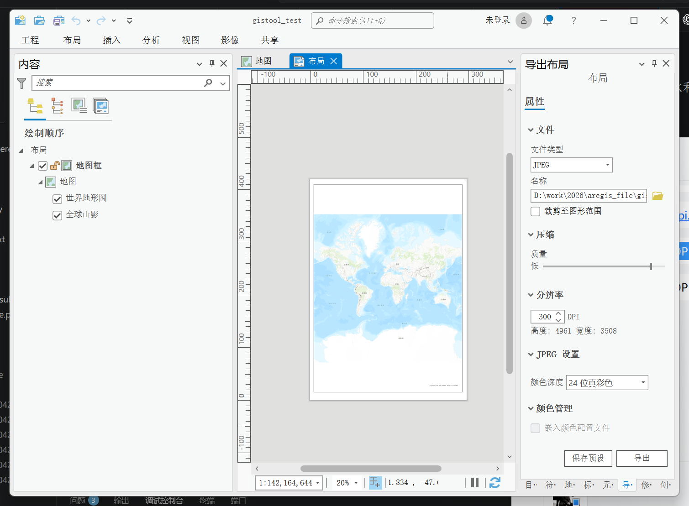
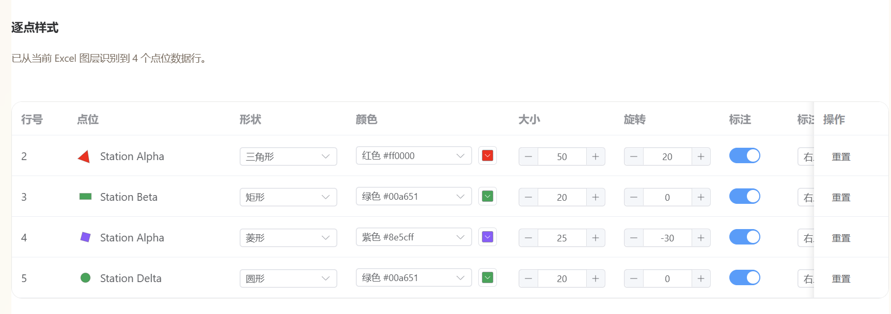

# GIS Flask Study Backend

这是一个简化后的快速出图 Web App。它简化了繁杂且缓慢的 ArcGIS Pro 操作步骤，方便水文水利行业工作者在编制报告时快速生成流域效果图。可能在配置环境会有一点点复杂（没办法，要怪就怪arcgis），但是可以用claude code或者codex等工具就简单啦，刷会儿抖音等一下就行了。后续会继续优化，敬请期待。

前提准备：

1. ArcGIS Pro 3.0.1 及以上。
2. ArcGIS Pro 的 `.aprx` 模板文件，也就是工程文件。需要提前在工程中创建好地图和布局（预制菜），因为 ArcGIS Pro 3.0 版本的 ArcPy 没有生成地图和布局的能力。

   
   
3. 流域边界、河流、站点 Excel 文件。

为什么要用这个web app而不直接用arcgis pro：
1. 速度更快，操作方便，小白也能轻松上手，在上面数据准备好的情况下，出图仅几秒。
2. 可以任意调节每个点的形状样式、大小，甚至可以旋转（水文中经常需要将站点旋转到垂直于河流方向）
  
3. 自由程度高。output中还有更改后的.aprx文件，更改全程在.aprx工程副本中，出结果后可以再用arcgis pro对结果进行一些微调。


## 快速使用 Web App

这个项目现在包含三个并列功能：流域出图、流域提取、生成流域边界。前端统一运行在 `5173`，后端按功能固定拆成 `5000/5001/5002` 三个进程，避免 ArcGIS Pro Python 和普通 GIS Python 依赖互相冲突。


### 最短部署路径

在当前项目结构下，最短路径就是：先准备两个 Python 运行时，再用统一脚本一次启动。

必备运行时：

- ArcGIS Pro Python / `propy.bat`：只负责流域出图，因为它需要 ArcPy。
- 普通 GIS Python：负责流域提取和生成流域边界，需要装好 `pysheds/rasterio/shapely/geopandas` 等依赖。当前开发机示例是 `D:\python3.9.5\python.exe`，但不是硬性路径。
- Node.js：负责启动 Vite 前端。

第一次部署先安装依赖：

`.\scripts\setup.ps1` 会把 Flask 等普通 Python 包安装到项目自己的 `.venv`。流域出图服务启动时仍然用 ArcGIS Pro Python / `propy.bat`，因为它负责提供 ArcPy；项目代码会在启动时把 `.venv\Lib\site-packages` 加进 ArcGIS Pro Python 的搜索路径，让 ArcGIS Pro Python 也能找到 Flask。

注意：当前 `setup.ps1` 用来创建项目 `.venv` 的 Python 版本固定检查为 `3.9`。这不代表三个后端都必须用 Python 3.9；它只说明这个安装脚本目前要求用 Python 3.9 来创建 `.venv`。如果电脑没有 `python3.9` 命令，可以传入完整路径：

```powershell
cd D:\work\2026\code\life\gis_flask_study
.\scripts\setup.ps1
```

```powershell
.\scripts\setup.ps1 -PythonPath "D:\Python39\python.exe"
```

再安装前端依赖：

```powershell
cd D:\work\2026\code\life\gis_flask_study\frontend
npm install
```

如果 ArcGIS Pro 不在默认位置，也可以先验证它能否从项目 `.venv` 导入 Flask：

```powershell
.\scripts\check_runtime.ps1 -PropyPath "D:\ArcGIS\Pro\bin\Python\Scripts\propy.bat"
```

然后回到项目根目录启动整套项目：

```powershell
cd D:\work\2026\code\life\gis_flask_study
.\scripts\start-dev.ps1
```

默认端口固定为：

| 端口 | 功能 | Python 环境 |
| --- | --- | --- |
| `5000` | 流域出图 `/map-output` | ArcGIS Pro Python / `propy.bat` |
| `5001` | 流域提取 `/watershed-extract` | 普通 GIS Python |
| `5002` | 生成流域边界 `/watershed-boundary-generator` | 普通 GIS Python |
| `5173` | Vite 前端 | Node.js |

如果 ArcGIS Pro 或普通 GIS Python 不在默认路径，启动时传入路径：

```powershell
.\scripts\start-dev.ps1 `
  -PropyPath "D:\ArcGIS\Pro\bin\Python\Scripts\propy.bat" `
  -GisPythonPath "D:\Python39\python.exe"
```

启动后检查健康接口：

```powershell
Invoke-RestMethod http://127.0.0.1:5000/api/health
Invoke-RestMethod http://127.0.0.1:5001/api/health
Invoke-RestMethod http://127.0.0.1:5002/api/health
```

浏览器打开：

```text
http://localhost:5173/
```

常用页面：

```text
http://localhost:5173/map-output
http://localhost:5173/watershed-extract
http://localhost:5173/watershed-boundary-generator
```

Vite 会按接口路径分流到固定后端端口：`/api/watershed-boundary` 走 `5002`，`/api/watershed` 走 `5001`，其他 `/api` 走 `5000`。所以前端页面不需要手动改接口地址。

### 单独启动某个后端

一般开发直接用 `scripts/start-dev.ps1`。只有排查问题时，才建议单独启动。

流域出图必须使用 ArcGIS Pro Python：

```powershell
cd D:\work\2026\code\life\gis_flask_study
$env:GIS_TOOL_SERVICE="render"
& "C:\Program Files\ArcGIS\Pro\bin\Python\Scripts\propy.bat" backend\run.py
```

流域提取使用普通 GIS Python：

```powershell
cd D:\work\2026\code\life\gis_flask_study
$env:GIS_TOOL_SERVICE="watershed"
& "D:\python3.9.5\python.exe" backend\run.py
```

生成流域边界使用普通 GIS Python：

```powershell
cd D:\work\2026\code\life\gis_flask_study
$env:GIS_TOOL_SERVICE="watershed-boundary"
& "D:\python3.9.5\python.exe" backend\run.py
```

前端单独启动：

```powershell
cd D:\work\2026\code\life\gis_flask_study\frontend
npm run dev -- --host 0.0.0.0 --port 5173
```

### 3. 站点 Excel 标准格式

前端会读取站点 Excel 第一个工作表的第一行作为表头，第二行开始作为点位数据。仓库里提供了一个可直接上传测试的标准示例：

[station_points_template.xlsx](docs/examples/station_points_template.xlsx)

最小必需字段：

| 字段 | 作用 | 示例 |
| --- | --- | --- |
| `name` | 点位名称，用于页面点位清单和标注字段 | `Station Alpha` |
| `lon` | 经度字段，上传后在“经度字段”里选择 | `116.18` |
| `lat` | 纬度字段，上传后在“纬度字段”里选择 | `39.18` |

可选字段：

| 字段 | 作用 |
| --- | --- |
| `alias` | 可作为“名称字段”切换显示，方便同名点区分 |
| `note` | 备注，不参与出图，可用于记录行号或说明 |

识别规则：

- 第一行必须是表头，点位数据从第二行开始。
- 前端用 Excel 原始行号识别点位：第二行是 `row_number = 2`，第三行是 `row_number = 3`。
- 同名点不会互相覆盖，页面会按不同 `row_number` 保留多条配置。
- Excel 不需要提前写形状、颜色、字号等样式；这些都在 Web App 的“逐点样式”表格里配置。
- 字段名不一定必须叫 `name/lon/lat`，但上传后要在页面中正确选择“名称字段、经度字段、纬度字段”。推荐直接使用模板字段，减少出错。

### 4. 在页面里完成一次出图

按左侧流程从上到下配置：

1. **基础数据**：上传 `.aprx` 模板、流域边界、河流水系和站点 Excel。Shapefile 建议打包成 `.zip` 上传，也可以一次选择 `.shp/.shx/.dbf/.prj` 等组件文件。
2. **图层样式**：配置流域边界、流域填充和河流水系样式。
3. **站点图层**：上传站点 Excel 后，页面会读取表头和每一行点位。先选择经度字段、纬度字段和名称字段，再在“逐点样式”表格里给每个点单独设置形状、颜色、大小、旋转和标注。
4. **输出设置**：填写输出目录、标题、图片宽高和 DPI。默认情况下，`output_dir` 应使用相对路径，例如 `frontend_202604210009`。
5. 点击页面底部的 **开始出图**，等待后端生成 PNG。

页面底部的“请求体预览”会显示实际提交给 `/api/render` 的 JSON。调试逐点站点时，可以重点检查：

```json
"station_layers": [
  {
    "points": [
      {
        "row_number": 2,
        "symbol": {
          "shape": "triangle",
          "color_preset": "red"
        }
      }
    ]
  }
]
```

只要请求体里有 `points`，后端就会按 Excel 原始行号逐点渲染；没有 `points` 时，则兼容旧逻辑，整张站点 Excel 使用同一套图层默认样式。

### 5. 查看出图结果

本次测试示例使用的是 `output/frontend_202604210009`。成功后会生成：

```text
output/frontend_202604210009/
  map.png
  result.json
  gistool_test.aprx
  station_group_table_0_0.csv
  station_layer_0_group_0.*
  station_group_table_0_1.csv
  station_layer_0_group_1.*
  ...
```

`station_layer_0_group_0.*`、`station_layer_0_group_1.*` 这类文件表示同一个 Excel 内部已经按不同样式拆成多个内部站点图层。样式相同的点会合并到同一个内部图层，样式不同的点会分开渲染。

下面是 `frontend_202604210009` 的示例结果，4 个站点来自同一个 Excel，但每个点使用了不同的符号样式：


### 常见问题

- 如果页面显示 `failed`，先打开对应输出目录里的 `result.json`，里面有真实 ArcPy 错误。
- 修改后端代码后，需要在后端 PowerShell 窗口按 `Ctrl + C` 停止服务，再重新运行 `backend\run.py`。
- 如果站点还是整层同一种颜色或形状，检查“请求体预览”里是否带有 `station_layers[].points`。
- 如果边缘点或标注被裁掉，确认后端已经重启到最新代码；当前版本会把流域、河流和站点一起纳入地图范围，并自动添加 buffer。

## 项目结构

```text
backend/
  run.py
  app/
    __init__.py
    api/
      health.py
      options.py
      render.py
    core/
      config.py
      constants.py
    gis/
      render/
        arcpy_renderer.py
    utils/
      responses.py
tests/
  test_backend_api.py
  test_arcpy_renderer.py
frontend/
  src/
    views/
    components/
    stores/
    api/
```

## 前端工作台

前端位于 `frontend/`，使用 Vue 3、Vite、TypeScript、Pinia、Axios 和 Element Plus。
页面风格借鉴 Gitee 参考项目的暖色纸张感工作台，但保留 Element Plus 的表单、上传和颜色选择器。

如果不用统一脚本，也可以单独启动前端：

```powershell
cd frontend
npm install
npm run dev -- --host 0.0.0.0 --port 5173
```

开发服务器默认地址是：

```text
http://localhost:5173
```

Vite 已按接口路径配置代理：`/api/watershed-boundary` 转到 `5002`，`/api/watershed` 转到 `5001`，其他 `/api` 转到 `5000`，所以前端可以直接调用对应 Flask 后端。

前端第一版支持：

- 上传 `.aprx` 模板、流域边界、河流水系、站点 Excel。
- Shapefile 建议打包成 `.zip` 上传。
- 配置输出尺寸、DPI、流域边界、流域填充、河流线宽和颜色。
- 支持一个站点 Excel 图层内逐点配置形状、颜色、大小、标注颜色、字号、位置和旋转角度。
- 在逐点样式表格里直接预览每个点当前的符号形状和颜色。
- 复制 `/api/render` JSON 请求体，方便继续用 Apifox 对照调试。
- 出图成功后在页面中预览最终 `map.png`。

三个后端默认都只监听本机 `127.0.0.1`，并且默认关闭 Flask debug。端口由 `GIS_TOOL_SERVICE` 固定决定，不再通过 `FLASK_PORT` 临时切换。开发时推荐用 `.\scripts\start-dev.ps1` 同时启动 `5000/5001/5002/5173`。局域网联调时再显式设置：

```powershell
$env:FLASK_HOST="0.0.0.0"
$env:FLASK_DEBUG="true"
```

## 通用环境部署

这个后端有一个特殊点：Flask 服务和 ArcPy 必须在同一个 Python 进程里运行。因为 ArcPy 只能由 ArcGIS Pro Python 提供，所以启动时仍然使用 `propy.bat`。

为了让新电脑部署更简单，项目启动时会自动把下面两个目录加入 Python 搜索路径：

```text
<项目根目录>\.venv\Lib\site-packages
C:\Users\<用户名>\AppData\Roaming\Python\Python39\site-packages
```

也就是说，Flask 可以固定安装在项目 `.venv` 里，不需要再手动安装到 ArcGIS Pro Python 环境目录。

可以用这条命令检查：

```powershell
.\scripts\check_runtime.ps1
```

如果能打印 `Flask OK`，并且 `Flask file` 位于项目 `.venv\Lib\site-packages` 下面，就可以直接启动后端。
如果报 `ModuleNotFoundError: No module named 'flask'`，或提示 Flask 不是从项目 `.venv` 加载的，先运行：

```powershell
.\scripts\setup.ps1
```

### 为什么不直接用 .venv 启动后端

不要用下面这种方式启动真实出图服务：

```powershell
.\.venv\Scripts\python.exe backend\run.py
```

原因是 `.venv` 里有 Flask，但没有 ArcPy。真实出图仍然必须由 ArcGIS Pro Python 启动。

### 兼容方式：用户 site-packages

项目仍然兼容用户目录 site-packages。也就是说，如果某台电脑以前已经把 Flask 安装到了当前用户目录，后端依然能找到它。不过推荐新部署时统一使用项目 `.venv`。

模板工程路径不在代码里写死。推荐由前端或 Apifox 在每次请求的 `template_project` 字段里传入。
如果某个部署环境固定使用同一个模板，也可以设置环境变量：

```powershell
$env:ARCPY_TEMPLATE_PROJECT="D:\your\template.aprx"
$env:ARCGIS_PROPY="D:\your\ArcGIS\Pro\bin\Python\Scripts\propy.bat"
$env:OUTPUT_FOLDER="D:\your\output"
& $env:ARCGIS_PROPY backend\run.py
```

如果请求体没有传 `template_project`，并且也没有设置 `ARCPY_TEMPLATE_PROJECT`，`POST /api/render` 会返回 400，提示缺少模板路径。

## 接口

### GET /api/health

检查服务是否启动，并返回当前输出目录和模板工程路径。

### GET /api/render-options

返回前端或 Apifox 可用的固定选项，包括底图、标注位置、站点形状和站点颜色预设。

站点形状和颜色已经拆开，前端可以自由组合：

```text
station_symbol_shapes:
circle
triangle
square
diamond
rectangle

station_symbol_color_presets:
blue
cyan
purple
orange
green
red
black
```

旧版 `preset` 字段仍然兼容，例如 `circle_green`、`triangle_red`，但新请求建议使用
`shape + color_preset` 或 `shape + color`。

### POST /api/render

直接出图。请求体里传真实数据文件路径和相对输出目录，不再传 `file_id`。
默认情况下，`output_dir` 必须是相对路径，例如 `"demo_001"`，后端会把结果写入 `OUTPUT_FOLDER/demo_001`。
这样前端不能让服务器写入任意绝对目录；只有本地调试时才建议临时设置 `ALLOW_ABSOLUTE_OUTPUT_DIR=true`。
`output.width_px`、`output.height_px` 和 `output.dpi` 会共同控制最终 PNG 的像素尺寸。
后端会自动按模板布局单位换算页面大小，例如模板使用毫米时会把 `1600x1200@150dpi` 换算成约 `270.93mm x 203.2mm`。

Apifox 示例：

```json
{
  "output_dir": "demo_001",
  "map_title": "示例流域水系图",
  "output": {
    "width_px": 1600,
    "height_px": 1200,
    "dpi": 150
  },
  "inputs": {
    "basin_boundary": {
      "path": "D:/data/basin.geojson"
    },
    "river_network": {
      "path": "D:/data/rivers.geojson"
    },
    "station_layers": [
      {
        "path": "D:/data/green_stations.xlsx",
        "sheet_name": "Sheet1",
        "x_field": "lon",
        "y_field": "lat",
        "name_field": "name",
        "layer_name": "GreenCircleStations",
        "symbol": {
          "shape": "circle",
          "color_preset": "green",
          "size_pt": 20
        },
        "label": {
          "enabled": true,
          "color": "#000000",
          "font_size_pt": 20,
          "position": "top_right",
          "rotation_deg": 0
        }
      },
      {
        "path": "D:/data/red_stations.xlsx",
        "sheet_name": "Sheet1",
        "x_field": "lon",
        "y_field": "lat",
        "name_field": "name",
        "layer_name": "RedTriangleStations",
        "symbol": {
          "shape": "triangle",
          "color_preset": "red",
          "size_pt": 20
        },
        "label": {
          "enabled": true,
          "color": "#000000",
          "font_size_pt": 20,
          "position": "top_right",
          "rotation_deg": 0
        }
      }
    ]
  },
  "layout": {
    "basemap": "Topographic",
    "legend": {
      "enabled": true
    },
    "scale_bar": {
      "enabled": true
    }
  },
  "style": {
    "basin_boundary": {
      "color": "#222222",
      "width_pt": 1.2
    },
    "basin_fill": {
      "color": "#e6f0d4",
      "opacity": 0.45
    },
    "river_network": {
      "color": "#2f80ed",
      "width_pt": 2.5
    }
  }
}
```

成功后会在 `output_dir` 生成：

```text
map.png
result.json
gistool_test.aprx
```

### POST /api/uploads

前端文件上传接口。浏览器不能可靠读取用户电脑的绝对路径，所以前端先把文件上传给后端，
后端保存到 `uploads/` 后返回可供 `/api/render` 使用的本地路径。

请求类型是 `multipart/form-data`：

```text
kind: template_project | basin_boundary | river_network | station_excel
file: 用户选择的文件
```

返回示例：

```json
{
  "success": true,
  "data": {
    "file_id": "uuid",
    "kind": "basin_boundary",
    "original_name": "basin.geojson",
    "path": "D:/work/.../uploads/20260420/uuid/basin.geojson",
    "suffix": ".geojson",
    "size_bytes": 1234
  }
}
```

### GET /api/render/file

前端预览最终 PNG 使用的只读接口：

```text
/api/render/file?path=<后端返回的 output_png>
```

为了避免任意文件读取，这个接口只允许读取 `OUTPUT_FOLDER` 下面的 `.png` 文件。

## 模板工程要求

当前 ArcPy 渲染器会在 `.aprx` 里查找这些对象：

```text
Map: 地图
Layout: 布局
Map Frame: 地图框
Title text element: 标题（兼容现有模板里的“文本”）
Legend element: 图例
Scale bar element: 比例尺
North arrow element: 指北针
```

图例、比例尺、指北针必须使用 ArcGIS Pro 原生布局元素，不要用普通图形或文字手动画。页面的“人工布局坐标”会把标题、图例、比例尺、指北针和地图框的 `x/y/宽/高` 原样传给后端，后端按模板布局单位写入 APRX；图例内部默认使用 `12 x 6` 的统一图样尺寸，并保留白色背景。地图视角可以选择自动范围、自动范围加四边留白，或手动输入 `xmin/ymin/xmax/ymax`。比例尺会在后端设置地图框范围后，由 ArcGIS Pro 根据最终地图框自动计算。模板中缺少任一布局元素时，出图仍会继续，缺失信息会写入 `result.json.warnings`。

## 测试

普通单元测试不需要 ArcGIS Pro：

```powershell
python -m pytest tests -q
```

真实 ArcPy 出图需要用 `propy.bat` 启动后端，然后用 Apifox 请求 `POST /api/render`。

## 多后端端口部署说明

当前项目同时包含“流域出图”“流域提取”“生成流域边界”三个功能。它们虽然共用同一套 Flask 项目代码，但不建议全部放在同一个 Python 环境里运行，因为依赖会冲突。

推荐端口和环境如下：

| 功能 | 页面 | API 前缀 | 端口 | 推荐 Python 环境 | 原因 |
| --- | --- | --- | --- | --- | --- |
| 流域出图 | `/map-output` | `/api/render`, `/api/uploads`, `/api/render-options` | `5000` | ArcGIS Pro Python / `propy.bat` | 需要 ArcPy |
| 流域提取 | `/watershed-extract` | `/api/watershed` | `5001` | 任意已安装 `pysheds` 等依赖的 Python 环境；当前开发机示例：`D:\python3.9.5\python.exe` | 需要 `pysheds` 等普通 GIS 包 |
| 生成流域边界 | `/watershed-boundary-generator` | `/api/watershed-boundary` | `5002` | 任意已安装 `rasterio`, `shapely`, `pysheds`, `geopandas` 的 Python 环境；当前开发机示例：`D:\python3.9.5\python.exe` | 需要 `rasterio`, `shapely`, `pysheds`, `geopandas` |

这次排查发现：ArcGIS Pro Python 里有 Flask 和 ArcPy，但没有 `rasterio/shapely/pysheds/geopandas`；而当前开发机的 `D:\python3.9.5` 环境里这些普通 GIS 包是完整的。所以流域提取和生成流域边界不要放到 `5000` 的 ArcGIS Python 进程里跑，但也不强制必须使用 `D:\python3.9.5`，换成其他依赖齐全的 Python 环境也可以。

### 启动顺序

推荐直接使用统一启动脚本。脚本会按固定端口和固定 Python 环境启动三套后端，并启动前端：

```powershell
cd D:\work\2026\code\life\gis_flask_study
.\scripts\start-dev.ps1
```

固定关系如下，代码里不再使用 `FLASK_PORT` 临时切换这三个开发后端端口：

```text
5000 -> 流域出图，GIS_TOOL_SERVICE=render，必须使用 ArcGIS Pro Python / propy.bat
5001 -> 流域提取，GIS_TOOL_SERVICE=watershed，使用普通 GIS Python 环境
5002 -> 生成流域边界，GIS_TOOL_SERVICE=watershed-boundary，使用普通 GIS Python 环境
5173 -> Vite 前端
```

如果 ArcGIS Pro 或普通 GIS Python 不在默认路径，可以传参：

```powershell
.\scripts\start-dev.ps1 `
  -PropyPath "D:\ArcGIS\Pro\bin\Python\Scripts\propy.bat" `
  -GisPythonPath "D:\Python39\python.exe"
```

先启动流域出图后端，也就是 ArcPy 后端：

```powershell
cd D:\work\2026\code\life\gis_flask_study
$env:GIS_TOOL_SERVICE="render"
& "C:\Program Files\ArcGIS\Pro\bin\Python\Scripts\propy.bat" backend\run.py
```

再启动流域提取后端。下面命令使用的是当前开发机已验证可用的 Python 示例路径；部署到其他电脑时，可以替换成任意依赖齐全的 Python 环境：

```powershell
cd D:\work\2026\code\life\gis_flask_study
$env:GIS_TOOL_SERVICE="watershed"
$env:FLASK_HOST="127.0.0.1"
& "D:\python3.9.5\python.exe" backend\run.py
```

再启动生成流域边界后端。同样，`D:\python3.9.5\python.exe` 只是当前开发机示例，不是硬性路径：

```powershell
cd D:\work\2026\code\life\gis_flask_study
$env:GIS_TOOL_SERVICE="watershed-boundary"
$env:FLASK_HOST="127.0.0.1"
& "D:\python3.9.5\python.exe" backend\run.py
```

最后启动前端：

```powershell
cd D:\work\2026\code\life\gis_flask_study\frontend
npm run dev
```

如果需要后台静默启动，可以使用。部署到其他电脑时，把 `D:\python3.9.5\python.exe` 替换成对应的 Python 路径：

```powershell
$env:GIS_TOOL_SERVICE="watershed"
$env:FLASK_HOST="127.0.0.1"
Start-Process -FilePath "D:\python3.9.5\python.exe" -ArgumentList "backend\run.py" -WorkingDirectory "D:\work\2026\code\life\gis_flask_study" -WindowStyle Hidden

$env:GIS_TOOL_SERVICE="watershed-boundary"
$env:FLASK_HOST="127.0.0.1"
Start-Process -FilePath "D:\python3.9.5\python.exe" -ArgumentList "backend\run.py" -WorkingDirectory "D:\work\2026\code\life\gis_flask_study" -WindowStyle Hidden
```

### Vite 代理顺序

`frontend/vite.config.ts` 里的代理顺序很重要。`/api/watershed-boundary` 必须写在 `/api/watershed` 前面，否则 `/api/watershed-boundary/generate` 会被 `/api/watershed` 前缀误匹配，转发到 `5001`。

推荐配置如下：

```ts
proxy: {
  '/api/watershed-boundary': {
    target: 'http://localhost:5002',
    changeOrigin: true
  },
  '/api/watershed': {
    target: 'http://localhost:5001',
    changeOrigin: true
  },
  '/api': {
    target: 'http://localhost:5000',
    changeOrigin: true
  }
}
```

修改 `vite.config.ts` 后必须重启 `npm run dev`，只刷新浏览器不会更新代理规则。

### 默认 DEM 路径

当前默认 DEM 路径统一为：

```text
D:\work\2026\code\data\data\dem\dem.tif
```

旧路径 `D:\work\data\data\dem\dem.tif` 在当前电脑上不存在，页面或后端如果仍使用旧路径，会出现 `DEM file does not exist` 或接口失败。

### 快速排查

检查端口是否都启动：

```powershell
netstat -ano | Select-String -Pattern ':5000|:5001|:5002|:5173'
```

检查健康接口：

```powershell
Invoke-RestMethod http://127.0.0.1:5000/api/health
Invoke-RestMethod http://127.0.0.1:5001/api/health
Invoke-RestMethod http://127.0.0.1:5002/api/health
```

常见问题：

- `/watershed-extract` 提示“后端服务不可用”：通常是 `5001` 没启动。
- `/watershed-boundary-generator` 提示“后端服务不可用”：先检查 `5002` 是否启动，再检查 Vite 代理是否已重启。
- 出现 `No module named 'rasterio'`：说明边界生成接口跑到了缺少依赖的 Python 环境，应改用已安装 `rasterio/shapely/pysheds/geopandas` 的 Python 环境启动 `5002`，例如当前开发机的 `D:\python3.9.5\python.exe`。
- 出现 `No module named 'pysheds'`：说明流域提取接口跑到了缺少依赖的 Python 环境，应改用已安装 `pysheds` 的 Python 环境启动 `5001`，例如当前开发机的 `D:\python3.9.5\python.exe`。

## tests 目录说明

`tests/` 主要用来保护两类核心行为：

- `test_backend_api.py`：测试 Flask API 层，使用 `FakeRenderer` 替代真实 `ArcPyRenderer`，确认接口能正确校验参数、传递参数并返回统一 JSON。
- `test_arcpy_renderer.py`：测试 `ArcPyRenderer` 本身，但使用 fake `arcpy` 和一组假的 ArcGIS Pro 对象，确认渲染器对 ArcPy 的调用方式、参数、样式、标注和输出结果是否正确。

这些测试能防止应用代码被改坏，但不能替代真实 ArcGIS Pro 环境验证。真正确认 ArcPy、模板工程和用户数据能跑通，仍然需要在 ArcGIS Pro Python 环境中用真实数据单独跑一次。
